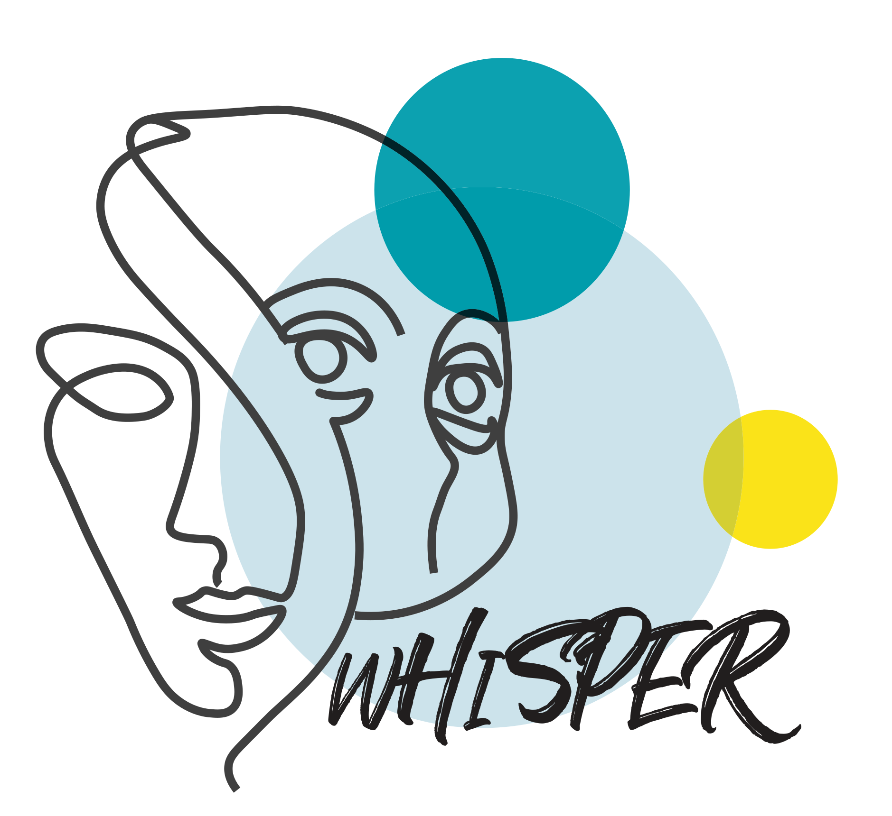
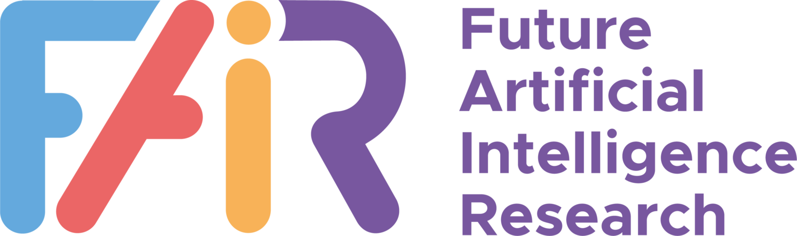



---

### Supported by

<table>
  <tr>
    <td>  </td>
    <td>  </td>
    <td>  </td>
  </tr>
</table>

---

<small class="text-muted">Spalsh art designed by Chahin Mohamed. "Scribbly Robot Frands". June, 2021. <a>https://www.artstation.com/artwork/B1PAAk</a></small>

